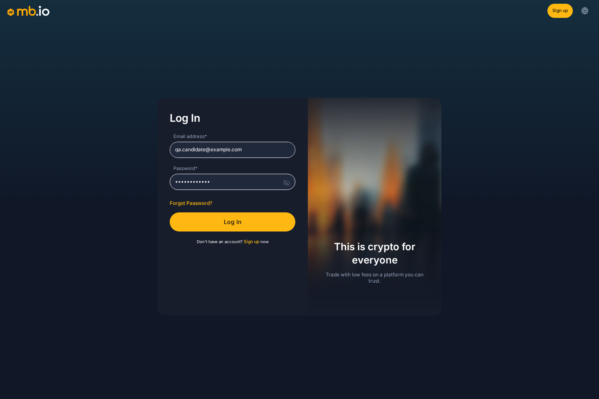
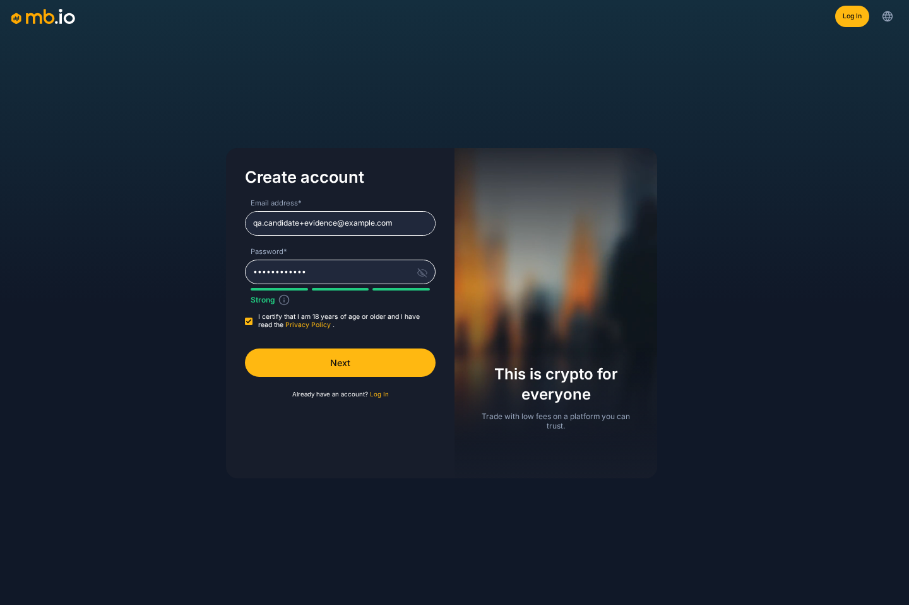
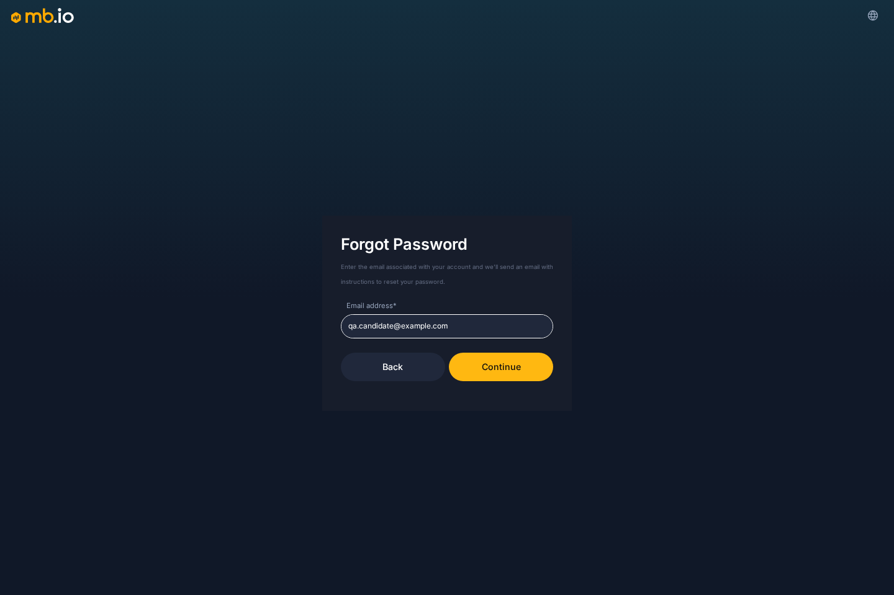
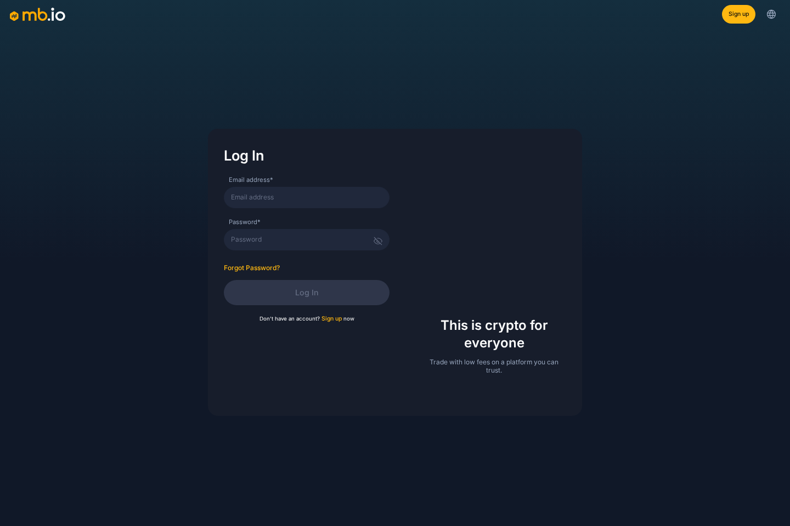
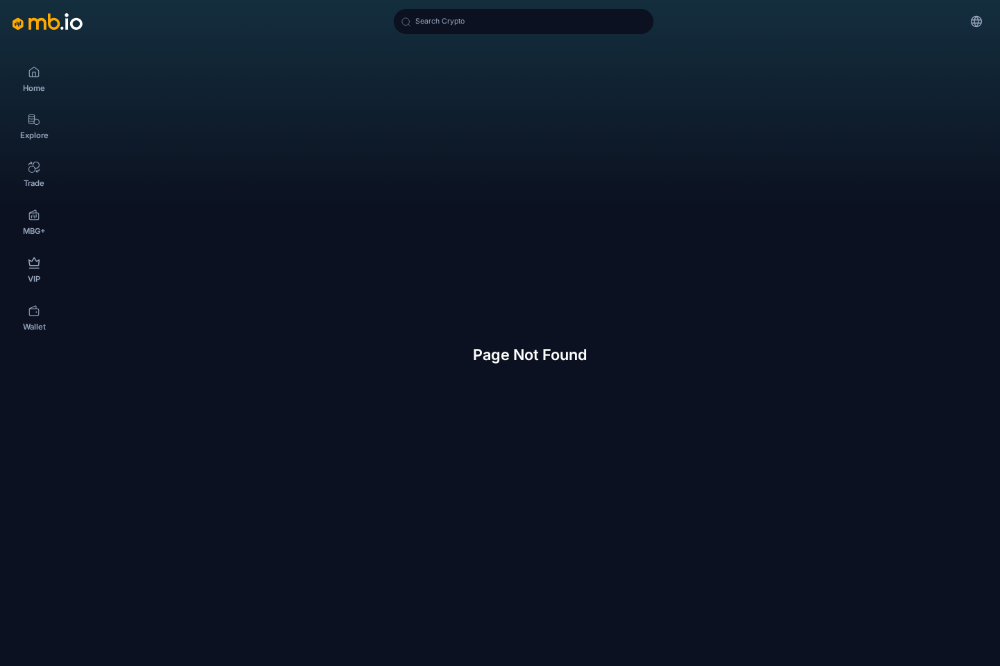
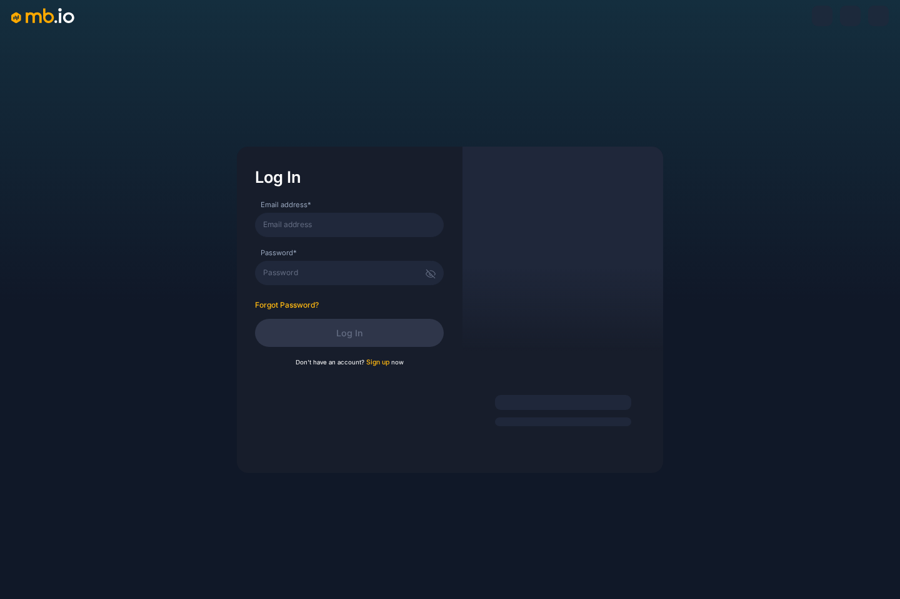
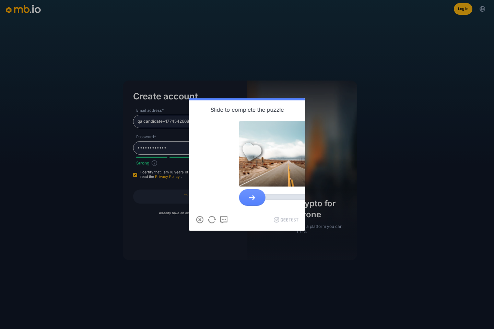
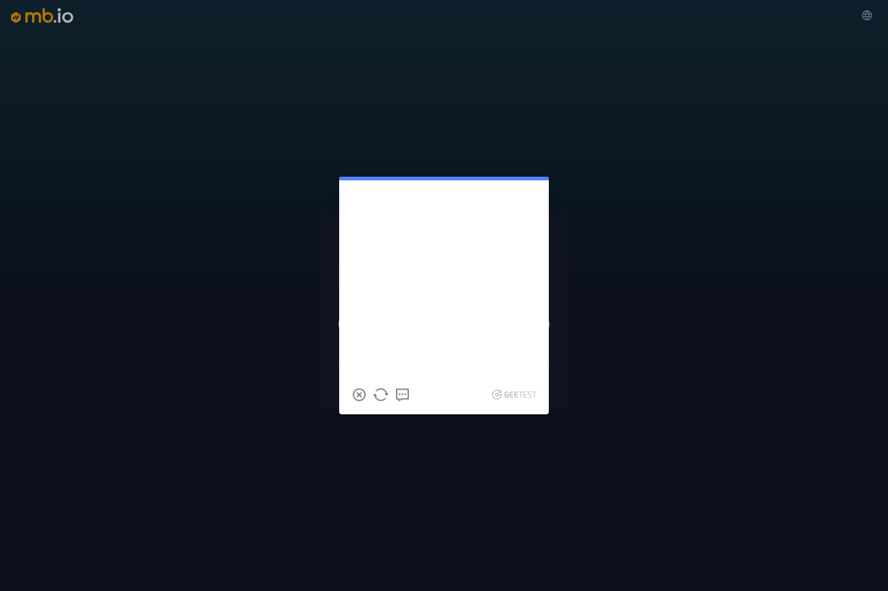
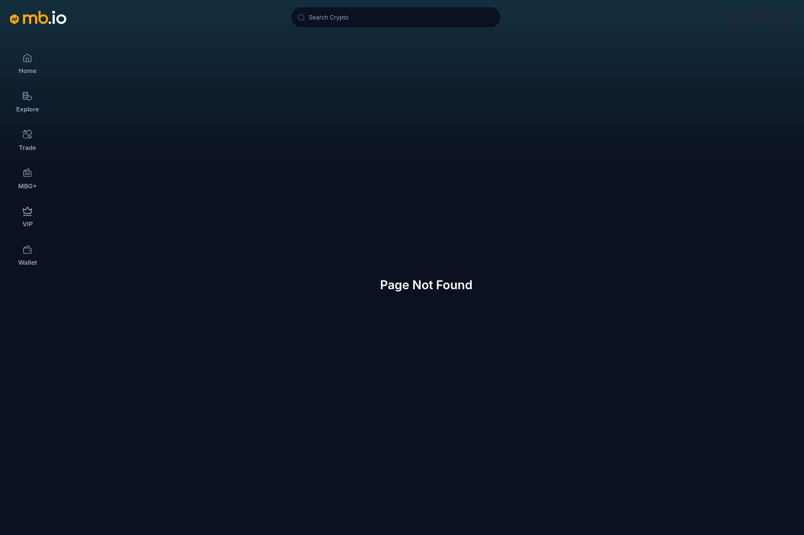

# Screenshot Gallery

These are the actual PNG screenshots captured from the live site.

## Chromium Login Filled

## Chromium Register Enabled

## Chromium Forgot Password Filled

## Chromium Wallet Redirect

## Chromium 404

## Existing Evidence: Chromium Login

## Existing Evidence: Chromium Register CAPTCHA

## Existing Evidence: Firefox Forgot Password CAPTCHA

## Existing Evidence: Firefox 404

